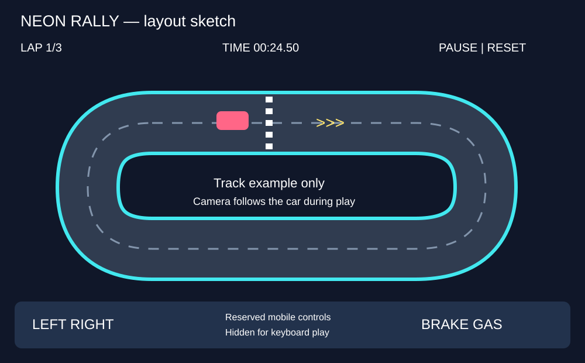
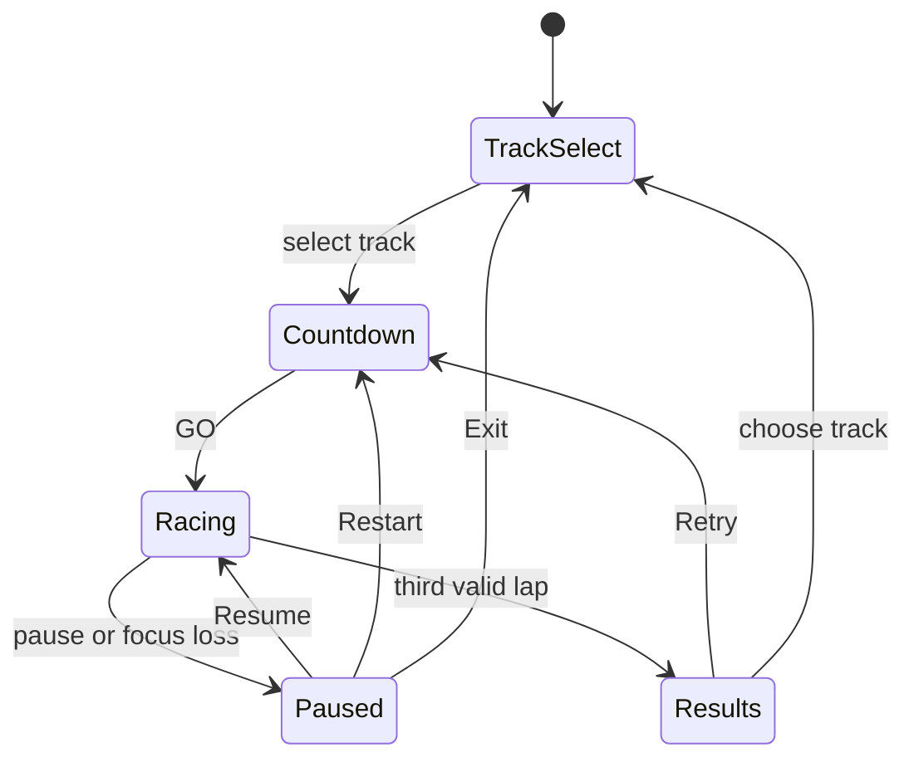
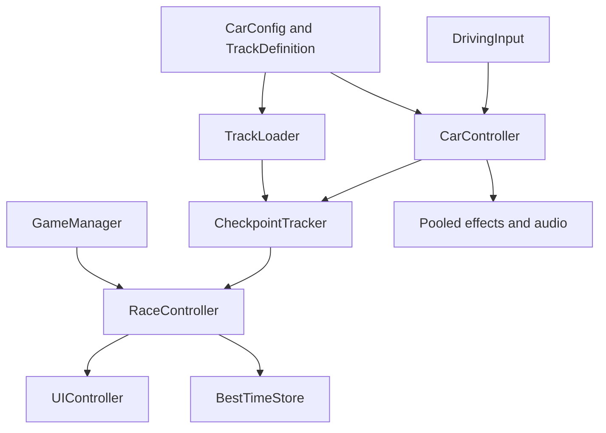

# Game Design Document — Neon Rally

**Proposal v0.1 — awaiting lecturer approval.** This replaces the proposed Blast Escape concept. No game implementation or test results are claimed.

| Field | Decision |
|---|---|
| Working title | Neon Rally |
| Team | Abed Alqader — solo designer and developer |
| Genre | Top-down 2D arcade circuit time trial |
| Target platforms | Windows standalone and Android APK |
| Engine | Unity 6.3 LTS **6000.3.20f1**, 2D |
| Orientation / reference | Landscape, 1920 × 1080 UI reference |
| Session length | Target 2–3 minutes per three-lap race |
| Document version | v0.1 — 2026-10-04 |

## 1. High Concept

Drive a neon racing car around three compact circuits, mastering corners and boost pads to beat each track's target time. Complete three valid laps through ordered checkpoints. Barriers punish careless driving with lost speed, while quick restarts encourage improvement. Race against the clock, save personal bests, and earn a clear success result on each track.

### Design pillars

1. **Handling comes first:** responsive steering and recoverable mistakes; no simulation gearbox or tuning garage.
2. **Readable speed:** visible road edges, advance corner markers and a stable camera; effects must never hide the route.
3. **Small, replayable scope:** one car, three authored tracks and one time-trial mode; no rival AI or open world.

## 2. Reference & Inspiration

Primary design inspiration is classic overhead arcade circuit racing. A modern visual reference is [Super Woden GP II — official publisher page](https://www.eastasiasoft.com/games/Super-Woden-GP-II). [Developer/publisher Steam page with gameplay trailers](https://store.steampowered.com/app/2083210/Super_Woden_GP_2/) provides reference footage: watch the first 30 seconds of a gameplay trailer for elevated camera framing and corner readability.

Taking: readable overhead circuits and short arcade driving challenges. Changing: use a directly overhead 2D camera, original neon artwork, a single car and time trials. Not taking: its cars, tracks, artwork, campaign, economy or multiplayer.

This is an original layout sketch, not a screenshot or a promise of final art. The circuit shown is illustrative. Despite the working title, the game uses closed circuits rather than off-road rally stages.

## 3. Core Game Loop

### Moment-to-moment rules

- Throttle accelerates toward a speed cap. Releasing it produces gradual drag; brake decelerates more strongly and never reverses. A stopped car may rotate slowly to recover from a wall.
- Left/right rotate the car relative to its heading. Steering response reduces smoothly at high speed. Lateral grip damps sideways velocity, permitting a small readable slide without a separate drift button.
- Solid barriers prevent leaving the course. Impacts reduce forward progress through the physics response; no health or vehicle destruction system. Grass slows the car. Track geometry prevents shortcuts through the infield.
- Every track has ordered, directional checkpoints. Only the next expected checkpoint advances progress. A lap counts only after all checkpoints and a forward finish crossing; the starting line does not grant a lap at launch.
- Each race is three laps. The clock starts on GO, stops on the third valid finish and freezes when paused. Passing the target time does not end the race: players may finish for practice.
- Boost pads temporarily raise acceleration and maximum speed for 1.25 seconds. A pad activates only on entry, with a per-pad cooldown of two seconds. Boosts refresh duration but never stack magnitude; acceleration and speed return smoothly to normal afterward.
- Reset Car returns to the most recent passed checkpoint in its forward direction, clears velocity and boost, and adds three seconds. It never grants checkpoint progress. Initial reset returns to the starting position.
- **Scoring:** lower elapsed time plus reset penalties is better. Finish within the track target to earn “Target Beaten”; otherwise show “Finished” and the time to improve. Save best valid three-lap time per track with PlayerPrefs.
- All tracks are available from the start. Restart resets time, lap progress, boost, inputs and car pose. No session score or unlock grind.

### Parameters to tune

| Parameter | Purpose | Initial guess |
|---|---|---|
| acceleration | Speed gain under throttle | 12 units/s² |
| maxSpeed | Normal forward cap | 14 units/s |
| brakeDeceleration | Braking strength | 22 units/s² |
| coastDrag | Speed loss off throttle | 3 units/s² |
| steeringRate | Base turn responsiveness | 150 degrees/s |
| lateralGrip | Sideways velocity damping | 8 per second |
| boostMultiplier / duration | Short speed advantage | 1.3 / 1.25 s |
| offRoadSpeedMultiplier | Grass penalty | 0.45 |
| resetPenalty | Cost of recovery | 3 s |
| targetTime | Three-lap success threshold | Per track, after playtesting |

Handling values live in a `CarConfig` ScriptableObject; track targets and checkpoints live in `TrackDefinition` assets. **Feel target:** a new player completes the introductory track's first lap within three attempts without verbal coaching. Target times are set only after timed playtests on both control schemes.

## 4. Controls & Input

| Action | Keyboard / mouse | Android touch | Gamepad |
|---|---|---|---|
| Throttle | W / Up | Hold accelerator | Out of scope |
| Brake | S / Down | Hold brake | Out of scope |
| Steer | A/D or Left/Right | Hold left/right buttons | Out of scope |
| Reset car | R | Reset button | Out of scope |
| Pause | Escape | Pause button | Out of scope |
| Menu actions | Mouse click | Tap | Out of scope |

Read keyboard input in Update and apply physics in FixedUpdate. Touch pointer events feed the same input state and support simultaneous steering and throttle. Brake takes priority over throttle; opposite steering inputs cancel. Clear held inputs on pause, reset and focus loss. Countdown and results disable driving. UI clicks never drive the car. App backgrounding pauses; returning requires Resume. Result buttons activate after a 0.5-second lockout.

## 5. Screens & UI

1. **Main menu:** title, Play, How to Play, Sound toggle, and Quit on Windows.
2. **Track select:** three named track cards, best time and target time; Start and Back.
3. **Gameplay:** elapsed time, lap 1/3, target, speed bar, Pause and Reset. Mobile places left/right at bottom-left and throttle/brake at bottom-right, outside the main driving view. No minimap, inventory or opponent standings.
4. **Pause:** Resume, Restart Race, Track Select.
5. **Results:** Target Beaten or Finished, final time, personal best, difference from target, Retry and Track Select.
6. **How to Play:** controls, checkpoint/lap rules, automatic boost pads and reset penalty; Back.

Use UGUI Screen Space Overlay and TextMeshPro. CanvasScaler: Scale With Screen Size, 1920 × 1080, match 0.5; safe-area-aware panels. Keep controls reachable on wide phones. A north-up orthographic camera follows position with smoothing and speed-based look-ahead in LateUpdate. It does not rotate with the car. Preview 16:9, 4:3 and wide-phone layouts.

## 6. Art & Audio

| Asset | Planned variants | Source and licence plan | Use |
|---|---|---|---|
| Car | One original car sprite | Original project artwork | Player |
| Tracks | Asphalt, grass, borders, arrows, boost pads | Original project artwork | Three circuits |
| Effects | Smoke puffs, sparks, skid marks | Original project artwork | Motion feedback |
| UI | Buttons, track thumbnails, speed bar | Original project artwork | Menus and HUD |
| Audio | Engine loop, tyre sound, impact, boost, countdown, finish | Original synthesized audio | Driving feedback |

No external game art is currently selected. If licensed assets are substituted, record exact creator, source and licence in `Docs/ASSET_CREDITS.md` before use. Reference games are inspiration only; their assets are not redistributed. Record AI assistance honestly.

Dark asphalt with cyan boundaries, a contrasting bright player car and yellow boost arrows. Give gameplay cues shapes as well as colours. Consistent sprite scale and sorting: ground → road markings → skid marks → car → particles → UI. Pool and cap effects; glow is optional and must remain inexpensive on mobile. Sound setting affects all audio and persists.

## 7. Technical Design

**Scenes:** MainMenu and Race; Race loads one of three track prefabs. **Systems:** Physics2D, UGUI, TextMeshPro, Unity object pools and ScriptableObjects. Use packages compatible with the exact editor and commit manifest/lock files. Begin with a custom small camera-follow component; no camera-package dependency is needed.

**Demo target:** user's Windows PC. Android test device or emulator must be recorded during validation; no successful APK build or performance measurement is claimed yet.

| Script | Responsibility |
|---|---|
| GameManager | Single session state and scene transitions |
| DrivingInput | Keyboard/touch input state |
| CarController | Acceleration, steering, grip and braking |
| TrackLoader | Create selected track and supply its references |
| CheckpointTracker | Ordered directional validation and safe reset pose |
| RaceController | Countdown, race timer, laps, penalties and results |
| BoostPad | Trigger non-stacking temporary boost |
| CameraFollow | Smoothed north-up follow and look-ahead |
| EffectPool | Reuse capped smoke and impact effects |
| UIController | Display data and route menu actions |
| AudioManager | Engine and one-shot sound playback |
| BestTimeStore | Store best times and sound preference |

### Course features and their purpose

1. **Object pooling:** reuse frequent smoke and impact objects, with bounded capacity and full state reset on return, avoiding repeated instantiate/destroy while driving.
2. **Coroutines:** countdown and boost duration use short timed sequences. Pause freezes gameplay timers; retry cancels obsolete coroutines.
3. **Singleton:** one GameManager persists between menu and race with duplicate-instance protection. Scene objects are not retained after unloading.
4. **Events:** lap, result and boost changes notify UI/audio. Balance subscriptions on enable/disable; do not rebuild unchanged labels each frame.
5. **ScriptableObjects:** tune car handling and per-track targets without changing code.
6. **Mobile build / persistence:** Android multitouch controls and APK, Windows build, and local personal bests.

**Verification plan:** try skipping/reversing checkpoints and camping on the finish; ensure only three valid laps finish. Verify reset penalties, pause during countdown/boost, touch cancellation and simultaneous controls, ten successive retries and saved times after relaunch. Drive every track on both target platforms. Profile effect-heavy turns for frame spikes and pool growth. Aim for 60 fps, recording measured device results rather than assuming them.

## 8. Scope

### 8.1 MVP

- [ ] One controllable car with readable collision and recovery behaviour.
- [ ] Menu, track selection, countdown, pause, results and retry.
- [ ] Ordered checkpoints, three laps, accurate timing and best-time saving.
- [ ] Three tracks: Starter Loop (broad corners), Switchback (alternating turns), Neon Sprint (straights and tighter corners).
- [ ] Automatic boost pads; keyboard and Android multitouch controls.
- [ ] Essential original visuals/audio and the listed course patterns.
- [ ] Working Windows build and Android APK with recorded validation.

Build and tune one complete track first. Only after that loop is playable, author the other two tracks from the same components. Playtest target times separately from initial guesses.

### 8.2 Polish after MVP

- [ ] Pooled tyre smoke, capped skid trails, sparks and gentle impact shake.
- [ ] Engine pitch follows speed, clear boost feedback and animated result reveal.
- [ ] Distinct track accent colours and informative track thumbnails.

### 8.3 Explicitly out of scope

- AI opponents, multiplayer, networking and online leaderboards.
- Open-world driving, procedural tracks and a track editor.
- Multiple cars, upgrades, economy and realistic damage.
- Ghost replays, weather simulation and day/night cycles.
- iOS, console builds and gamepad support.

## Changelog

| Version | Date | Change |
|---|---|---|
| v0.1 | 2026-10-04 | Initial Neon Rally proposal, replacing the earlier Bomberman-inspired concept; lecturer approval pending. |
